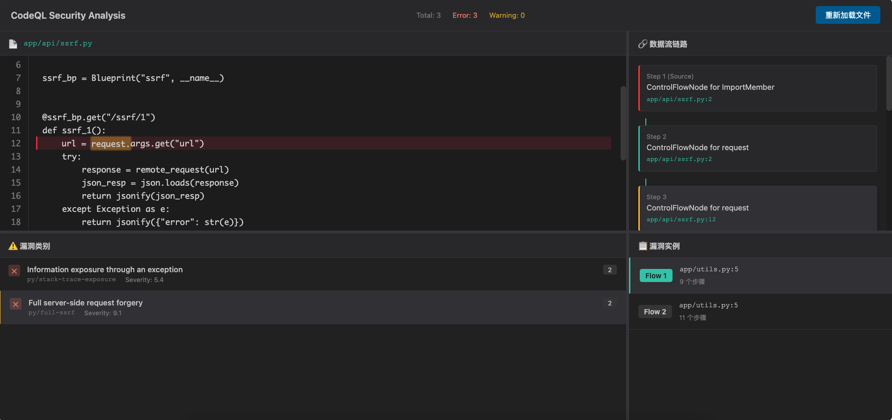

# Codeql Sarif Viewer

生成codeql sarif格式报告，在浏览器打开sarif-viewer.html，导入报告即可查看漏洞链路。

```shell
# example

# create database
codeql database create vuln-flask-db -s vuln-flask-app -l python

# analyze database
codeql database analyze vuln-flask-db -o vuln-flask-full.sarif --format=sarif-latest --sarif-add-snippets --sarif-add-file-contents

codeql database analyze vuln-flask-db -o vuln-flask-medium.sarif --format=sarif-latest --sarif-add-snippets

codeql database analyze vuln-flask-db -o vuln-flask-brief.sarif --format=sarif-latest
```

导入报告


查看漏洞链路


